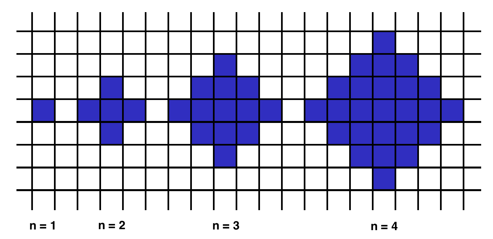
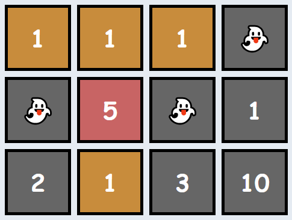

# Overview of all functions 

## Adjacent Elements Product

Given an array of integers, find the pair of adjacent elements that has the largest product and return that product.

#### Example

For `inputArray = [3, 6, -2, -5, 7, 3]`, the output should be
`adjacentElementsProduct(inputArray) = 21`.

`7` and `3` produce the largest product.

#### Input/Output

* **[input] array.integer inputArray**

  An array of integers containing at least two elements.

  Guaranteed constraints:
  2 ≤ inputArray.length ≤ 10,
  -1000 ≤ inputArray[i] ≤ 1000.

* **[output] integer**

  The largest product of adjacent elements.

## Shape Area

Below we will define an `n`-interesting polygon. Your task is to find the area of a polygon for a given `n`.

A `1`-interesting polygon is just a square with a side of length `1`. An `n`-interesting polygon is obtained by taking the `n - 1`-interesting polygon and appending `1`-interesting polygons to its rim, side by side. You can see the `1`-, `2`-, `3`- and `4`-interesting polygons in the picture below.

#### Example

* For `n = 2`, the output should be
  `shapeArea(n) = 5`;
* For `n = 3`, the output should be
  `shapeArea(n) = 13`.
#### Input/Output

* **[input] integer n**

  Guaranteed constraints:
  1 ≤ n < 104.

* **[output] integer**

  The area of the `n`-interesting polygon.

## Make Array Consecutive 2

Ratiorg got `statues` of different sizes as a present from CodeMaster for his birthday, each statue having an non-negative integer size. 
Since he likes to make things perfect, he wants to arrange them from smallest to largest so that each statue will be bigger than the 
previous one exactly by `1`. He may need some additional statues to be able to accomplish that. Help him figure out the minimum number of 
additional statues needed.

#### Example

For `statues = [6, 2, 3, 8]`, the output should be
`makeArrayConsecutive2(statues) = 3`.

Ratiorg needs statues of sizes `4`, `5` and `7`.

#### Input/Output

* **[input] array.integer statues**

  An array of distinct non-negative integers.

  Guaranteed constraints:
  1 ≤ statues.length ≤ 10,
  0 ≤ statues[i] ≤ 20.

* **[output] integer**

  The minimal number of statues that need to be added to existing `statues` such that it contains every integer size from an 
  interval `[L, R]` (for some `L, R`) and no other sizes.

## Almost Increasing Sequence

Given a sequence of integers as an array, determine whether it is possible to obtain a strictly increasing sequence by removing no more 
than one element from the array.

Note: sequence `a0`, `a1`, ..., `an` is considered to be a strictly increasing if `a0 < a1 < ... < an`. Sequence containing only one element is
also considered to be strictly increasing.

#### Example

* For `sequence = [1, 3, 2, 1]`, the output should be
  `almostIncreasingSequence(sequence) = false`.

  There is no one element in this array that can be removed in order to get a strictly increasing sequence.

* For `sequence = [1, 3, 2]`, the output should be
  `almostIncreasingSequence(sequence) = true`.

  You can remove `3` from the array to get the strictly increasing sequence `[1, 2]`. Alternately, you can remove `2` to get the strictly increasing sequence `[1, 3]`.

#### Input/Output

* **[input] array.integer sequence**

  Guaranteed constraints:
  2 ≤ sequence.length ≤ 105,
  -105 ≤ sequence[i] ≤ 105.

* **[output] boolean**

  Return `true` if it is possible to remove one element from the array in order to get a strictly increasing sequence, otherwise return `false`.

## Matrix Elements Sums

After becoming famous, the CodeBots decided to move into a new building together. Each of the rooms has a different cost, and some of them are free, but there's a rumour that all the free rooms are haunted! Since the CodeBots are quite superstitious, they refuse to stay in any of the free rooms, **or any of the rooms below any of the free rooms**.

Given `matrix`, a rectangular matrix of integers, where each value represents the cost of the room, your task is to return the total sum 
of all rooms that are suitable for the CodeBots (ie: add up all the values that don't appear below a `0`).

#### Example

* For

  `matrix = [[0, 1, 1, 2], 
            [0, 5, 0, 0], 
            [2, 0, 3, 3]]`
  the output should be
  `matrixElementsSum(matrix) = 9`.

  There are several haunted rooms, so we'll disregard them as well as any rooms beneath them. Thus, the answer is `1 + 5 + 1 + 2 = 9`.

* For

  `matrix = [[1, 1, 1, 0], 
            [0, 5, 0, 1], 
            [2, 1, 3, 10]]`
  the output should be
  `matrixElementsSum(matrix) = 9`.

  Note that the free room in the final column makes the full column unsuitable for bots (not just the room directly beneath it). 
  Thus, the answer is `1 + 1 + 1 + 5 + 1 = 9`.

#### Input/Output

* **[input] array.array.integer matrix**

  A 2-dimensional array of integers representing the cost of each room in the building. A value of `0` indicates that the room is haunted.

  Guaranteed constraints:
  1 ≤ matrix.length ≤ 5,
  1 ≤ matrix[i].length ≤ 5,
  0 ≤ matrix[i][j] ≤ 10.

* **[output] integer**

  The total price of all the rooms that are suitable for the CodeBots to live in.
