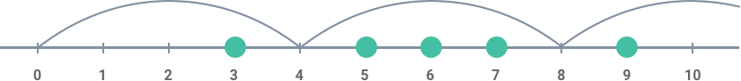

# Overview of all Functions

## Are Equally Strong

Call two arms *equally strong* if the heaviest weights they each are able to lift are equal.

Call two people *equally strong* if their strongest arms are equally strong (the strongest arm can be both the right and the left), and so are their weakest arms.

Given your and your friend's arms' lifting capabilities find out if you two are equally strong.

#### Example

* For `yourLeft = 10`, `yourRight = 15`, `friendsLeft = 15`, and `friendsRight = 10`, the output should be
  `areEquallyStrong(yourLeft, yourRight, friendsLeft, friendsRight) = true`;
* For `yourLeft = 15`, `yourRight = 10`, `friendsLeft = 15`, and `friendsRight = 10`, the output should be
  `areEquallyStrong(yourLeft, yourRight, friendsLeft, friendsRight) = true`;
* For `yourLeft = 15`, `yourRight = 10`, `friendsLeft = 15`, and `friendsRight = 9`, the output should be
  `areEquallyStrong(yourLeft, yourRight, friendsLeft, friendsRight) = false`.
#### Input/Output

* **[input] integer yourLeft**

  A non-negative integer representing the heaviest weight you can lift with your left arm.

  Guaranteed constraints:
  0 ≤ yourLeft ≤ 20.

* **[input] integer yourRight**

  A non-negative integer representing the heaviest weight you can lift with your right arm.

  Guaranteed constraints:
  0 ≤ yourRight ≤ 20.

* **[input] integer friendsLeft**

  A non-negative integer representing the heaviest weight your friend can lift with his or her left arm.

  Guaranteed constraints:
  0 ≤ friendsLeft ≤ 20.

* **[input] integer friendsRight**

  A non-negative integer representing the heaviest weight your friend can lift with his or her right arm.

  Guaranteed constraints:
  0 ≤ friendsRight ≤ 20.

* **[output] boolean**

  `true` if you and your friend are equally strong, `false` otherwise.

## Array Maximal Adjacent Difference

Given an array of integers, find the maximal absolute difference between any two of its adjacent elements.

#### Example

For `inputArray = [2, 4, 1, 0]`, the output should be
`arrayMaximalAdjacentDifference(inputArray) = 3`.

#### Input/Output

* **[input] array.integer inputArray**

  Guaranteed constraints:
  3 ≤ inputArray.length ≤ 10,
  -15 ≤ inputArray[i] ≤ 15.

* **[output] integer**

  The maximal absolute difference.

## Is IPv4 Address

An IP address is a numerical label assigned to each device (e.g., computer, printer) participating in a computer network that uses the Internet Protocol for communication. There are two versions of the Internet protocol, and thus two versions of addresses. One of them is the IPv4 address.

Given a string, find out if it satisfies the IPv4 address naming rules.

#### Example

* For `inputString = "172.16.254.1"`, the output should be
  `isIPv4Address(inputString) = true`;

* For `inputString = "172.316.254.1"`, the output should be
  `isIPv4Address(inputString) = false`.

  `316` is not in range `[0, 255]`.

* For `inputString = ".254.255.0"`, the output should be
  `isIPv4Address(inputString) = false`.

  There is no first number.

#### Input/Output

* **[input] string inputString**

  A string consisting of digits, full stops and lowercase English letters.

  Guaranteed constraints:
  1 ≤ inputString.length ≤ 30.

* **[output] boolean**

  `true` if `inputString` satisfies the IPv4 address naming rules, `false` otherwise.

## Avoid Obstacles

You are given an array of integers representing coordinates of obstacles situated on a straight line.

Assume that you are jumping from the point with coordinate `0` to the right. You are allowed only to make jumps of the same length represented by some integer.

Find the minimal length of the jump enough to avoid all the obstacles.

#### Example

For `inputArray = [5, 3, 6, 7, 9]`, the output should be
`avoidObstacles(inputArray) = 4`.

Check out the image below for better understanding:

#### Input/Output

* **[input] array.integer inputArray**

Non-empty array of positive integers.

Guaranteed constraints:
2 ≤ inputArray.length ≤ 1000,
1 ≤ inputArray[i] ≤ 1000.

* **[output] integer**

The desired length.

## Box Blur

Last night you partied a little too hard. Now there's a black and white photo of you that's about to go viral! You can't let this ruin your reputation, so you want to apply the *box blur algorithm* to the photo to hide its content.

The pixels in the input image are represented as integers. The algorithm distorts the input image in the following way: Every pixel `x` in the output image has a value equal to the average value of the pixel values from the `3 × 3` square that has its center at `x`, including `x` itself. All the pixels on the border of `x` are then removed.

Return the blurred image as an integer, with the fractions rounded down.

#### Example

For

image = 

         [[1, 1, 1], 
         [1, 7, 1], 
         [1, 1, 1]]
the output should be `boxBlur(image) = [[1]]`.

To get the value of the middle pixel in the input `3 × 3` square: `(1 + 1 + 1 + 1 + 7 + 1 + 1 + 1 + 1) = 15 / 9 = 1.66666 = 1`. The border pixels are cropped from the final result.

For

image = 

         [[7, 4, 0, 1], 
         [5, 6, 2, 2], 
         [6, 10, 7, 8], 
         [1, 4, 2, 0]]
the output should be

`boxBlur(image) = [[5, 4], 
                  [4, 4]]`
There are four `3 × 3` squares in the input image, so there should be four integers in the blurred output. To get the first value: `(7 + 4 + 0 + 5 + 6 + 2 + 6 + 10 + 7) = 47 / 9 = 5.2222 = 5`. The other three integers are obtained the same way, then the surrounding integers are cropped from the final result.

#### Input/Output

* **[input] array.array.integer image**

An image, stored as a rectangular matrix of non-negative integers.

Guaranteed constraints:
3 ≤ image.length ≤ 100,
3 ≤ image[0].length ≤ 100,
0 ≤ image[i][j] ≤ 255.

* **[output] array.array.integer**

A blurred image represented as integers, obtained through the process in the description.

## Minesweeper

In the popular **Minesweeper** game you have a board with some mines and those cells that don't contain a mine have a number in it that indicates the total number of mines in the neighboring cells. Starting off with some arrangement of mines we want to create a **Minesweeper** game setup.

#### Example

For

matrix = 

          [[true, false, false],
          [false, true, false],
          [false, false, false]]
the output should be

minesweeper(matrix) = 

                       [[1, 2, 1],
                       [2, 1, 1],
                       [1, 1, 1]]
Check out the image below for better understanding:

#### Input/Output

* **[input] array.array.boolean matrix**

A non-empty rectangular matrix consisting of boolean values - `true` if the corresponding cell contains a mine, `false` otherwise.

Guaranteed constraints:
2 ≤ matrix.length ≤ 100,
2 ≤ matrix[0].length ≤ 100.

* **[output] array.array.integer**

Rectangular matrix of the same size as `matrix` each cell of which contains an integer equal to the number of mines in the neighboring cells. Two cells are called neighboring if they share at least one corner.