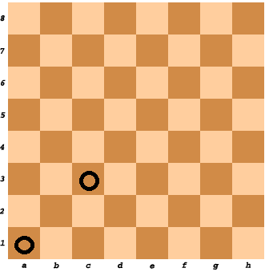

# Overview of all Functions

## Array Replace

Given an array of integers, replace all the occurrences of elemToReplace with substitutionElem.

#### Example

For inputArray = [1, 2, 1], elemToReplace = 1, and substitutionElem = 3, the output should be
arrayReplace(inputArray, elemToReplace, substitutionElem) = [3, 2, 3].

Input/Output

* **[input] array.integer inputArray**

  Guaranteed constraints:
  0 ≤ inputArray.length ≤ 104,
  0 ≤ inputArray[i] ≤ 109.

* **[input] integer elemToReplace**

  Guaranteed constraints:
  0 ≤ elemToReplace ≤ 109.

* **[input] integer substitutionElem**

  Guaranteed constraints:
  0 ≤ substitutionElem ≤ 109.

* **[output] array.integer**

## Even Digits Only

Check if all digits of the given integer are even.

#### Example

* For n = 248622, the output should be
  evenDigitsOnly(n) = true;
* For n = 642386, the output should be
  evenDigitsOnly(n) = false.
#### Input/Output

* **[input] integer n**

  Guaranteed constraints:
  1 ≤ n ≤ 109.

* **[output] boolean**

  true if all digits of n are even, false otherwise.

## Variable Name

Correct variable names consist only of English letters, digits and underscores and they can't start with a digit.

Check if the given string is a correct variable name.

#### Example

* For name = "var_1__Int", the output should be
  variableName(name) = true;
* For name = "qq-q", the output should be
  variableName(name) = false;
* For name = "2w2", the output should be
  variableName(name) = false.
#### Input/Output

* **[input] string name**

  Guaranteed constraints:
  1 ≤ name.length ≤ 10.

* **[output] boolean**

  true if name is a correct variable name, false otherwise.

## Alphabetic Shift

Given a string, your task is to replace each of its characters by the next one in the English alphabet; i.e. replace a with b, replace b with c, etc (z would be replaced by a).

#### Example

For inputString = "crazy", the output should be alphabeticShift(inputString) = "dsbaz".

#### Input/Output

* **[input] string inputString**

  A non-empty string consisting of lowercase English characters.

  Guaranteed constraints:
  1 ≤ inputString.length ≤ 1000.

* **[output] string**

  The resulting string after replacing each of its characters.

## Chess Board Cell Color

Given two cells on the standard chess board, determine whether they have the same color or not.

Example

* For cell1 = "A1" and cell2 = "C3", the output should be
  chessBoardCellColor(cell1, cell2) = true.

* For cell1 = "A1" and cell2 = "H3", the output should be
  chessBoardCellColor(cell1, cell2) = false.

#### Input/Output

* **[input] string cell1**

  Guaranteed constraints:
  cell1.length = 2,
  'A' ≤ cell1[0] ≤ 'H',
  1 ≤ cell1[1] ≤ 8.

* **[input] string cell2**

  Guaranteed constraints:
  cell2.length = 2,
  'A' ≤ cell2[0] ≤ 'H',
  1 ≤ cell2[1] ≤ 8.

* **[output] boolean**

  true if both cells have the same color, false otherwise.