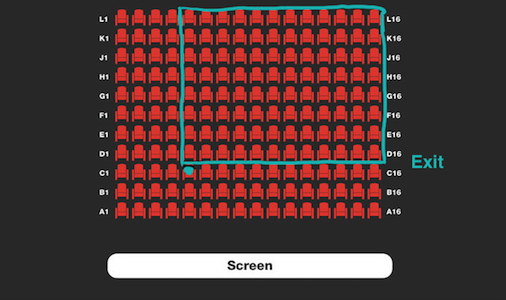

# Overview of all functions 

## Add Two Digits

You are given a two-digit integer n. Return the sum of its digits.

#### Example

For n = 29, the output should be
addTwoDigits(n) = 11.

#### Input/Output

* **[input] integer n**

A positive two-digit integer.

Guaranteed constraints:
10 ≤ n ≤ 99.

* **[output] integer**

The sum of the first and second digits of the input number.

## Largest Number

Given an integer n, return the largest number that contains exactly n digits.

#### Example

For n = 2, the output should be
largestNumber(n) = 99.

#### Input/Output

* **[input] integer n**

Guaranteed constraints:
1 ≤ n ≤ 9.

* **[output] integer**

The largest integer of length n.

## Candies

n children have got m pieces of candy. They want to eat as much candy as they can, but each child must eat exactly the same amount of candy as any other child. Determine how many pieces of candy will be eaten by all the children together. Individual pieces of candy cannot be split.

#### Example

For n = 3 and m = 10, the output should be
candies(n, m) = 9.

Each child will eat 3 pieces. So the answer is 9.

#### Input/Output

* **[input] integer n**

The number of children.

Guaranteed constraints:
1 ≤ n ≤ 10.

* **[input] integer m**

The number of pieces of candy.

Guaranteed constraints:
2 ≤ m ≤ 100.

* **[output] integer**

The total number of pieces of candy the children will eat provided they eat as much as they can and all children eat the same amount.

## Seats in Theater

Your friend advised you to see a new performance in the most popular theater in the city. He knows a lot about art and his advice is usually good, but not this time: the performance turned out to be awfully dull. It's so bad you want to sneak out, which is quite simple, especially since the exit is located right behind your row to the left. All you need to do is climb over your seat and make your way to the exit.

The main problem is your shyness: you're afraid that you'll end up blocking the view (even if only for a couple of seconds) of all the people who sit behind you and in your column or the columns to your left. To gain some courage, you decide to calculate the number of such people and see if you can possibly make it to the exit without disturbing too many people.

Given the total number of rows and columns in the theater (nRows and nCols, respectively), and the row and column you're sitting in, return the number of people who sit strictly behind you **and** in your column or to the left, assuming all seats are occupied.

#### Example

For nCols = 16, nRows = 11, col = 5, and row = 3, the output should be
seatsInTheater(nCols, nRows, col, row) = 96.

Here is what the theater looks like:

#### Input/Output

* **[input] integer nCols**

An integer, the number of theater's columns.

Guaranteed constraints:
1 ≤ nCols ≤ 1000.

* **[input] integer nRows**

An integer, the number of theater's rows.

Guaranteed constraints:
1 ≤ nRows ≤ 1000.

* **[input] integer col**

An integer, the column number of your own seat (1-based).

Guaranteed constraints:
1 ≤ col ≤ nCols.

* **[input] integer row**

An integer, the row number of your own seat (1-based).

Guaranteed constraints:
1 ≤ row ≤ nRows.

* **[output] integer**

The number of people who sit strictly behind you and in your column or to the left.

## Max Multiple

Given a divisor and a bound, find the largest integer N such that:

* N is divisible by divisor.
* N is less than or equal to bound.
* N is greater than 0.
It is guaranteed that such a number exists.

#### Example

For divisor = 3 and bound = 10, the output should be
maxMultiple(divisor, bound) = 9.

The largest integer divisible by 3 and not larger than 10 is 9.

#### Input/Output

* **[input] integer divisor**

Guaranteed constraints:
2 ≤ divisor ≤ 10.

* **[input] integer bound**

Guaranteed constraints:
5 ≤ bound ≤ 100.

* **[output] integer**

The largest integer not greater than bound that is divisible by divisor.

## Circle of Numbers

Consider integer numbers from 0 to n - 1 written down along the circle in such a way that the distance between any two neighboring numbers is equal (note that 0 and n - 1 are neighboring, too).

Given n and firstNumber, find the number which is written in the radially opposite position to firstNumber.

#### Example

For n = 10 and firstNumber = 2, the output should be
circleOfNumbers(n, firstNumber) = 7.

Input/Output

[execution time limit] 4 seconds (py3)

[input] integer n

A positive even integer.

Guaranteed constraints:
4 ≤ n ≤ 20.

[input] integer firstNumber

Guaranteed constraints:
0 ≤ firstNumber ≤ n - 1.

[output] integer