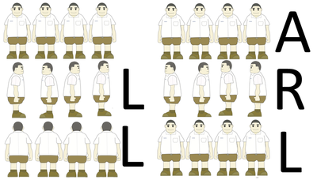

# Overview of all Functions

## Least Factorial

Given an integer n, find the minimal k such that

* k = m! (where m! = 1 * 2 * ... * m) for some integer m;
* k >= n.
In other words, find the smallest factorial which is not less than n.

#### Example

For n = 17, the output should be
leastFactorial(n) = 24.

17 < 24 = 4! = 1 * 2 * 3 * 4, while 3! = 1 * 2 * 3 = 6 < 17).

#### Input/Output

* **[input] integer n**

A positive integer.

Guaranteed constraints:
1 ≤ n ≤ 120.

* **[output] integer**

## Count Sum of Two Representations 2

Given integers n, l and r, find the number of ways to represent n as a sum of two integers A and B such that l ≤ A ≤ B ≤ r.

#### Example

For n = 6, l = 2, and r = 4, the output should be
countSumOfTwoRepresentations2(n, l, r) = 2.

There are just two ways to write 6 as A + B, where 2 ≤ A ≤ B ≤ 4: 6 = 2 + 4 and 6 = 3 + 3.

#### Input/Output

* **[input] integer n**

A positive integer.

Guaranteed constraints:
5 ≤ n ≤ 109.

* **[input] integer l**

A positive integer.

Guaranteed constraints:
1 ≤ l ≤ r.

* **[input] integer r**

A positive integer.

Guaranteed constraints:
l ≤ r ≤ 109,
r - l ≤ 106.

* **[output] integer**

## Magical Well

You are standing at a magical well. It has two positive integers written on it: a and b. Each time you cast a magic marble into the well, it gives you a * b dollars and then both a and b increase by 1. You have n magic marbles. How much money will you make?

#### Example

For a = 1, b = 2, and n = 2, the output should be
magicalWell(a, b, n) = 8.

You will cast your first marble and get $2, after which the numbers will become 2 and 3. When you cast your second marble, the well will give you $6. Overall, you'll make $8. So, the output is 8.

#### Input/Output

* **[input] integer a**

Guaranteed constraints:
1 ≤ a ≤ 2000.

* **[input] integer b**

Guaranteed constraints:
1 ≤ b ≤ 2000.

* **[input] integer n**

The number of magic marbles in your possession, a non-negative integer.

Guaranteed constraints:
0 ≤ n ≤ 5.

* **[output] integer**

## Lineup

To prepare his students for an upcoming game, the sports coach decides to try some new training drills. To begin with, he lines them up and starts with the following warm-up exercise: when the coach says 'L', he instructs the students to turn to the left. Alternatively, when he says 'R', they should turn to the right. Finally, when the coach says 'A', the students should turn around.

Unfortunately some students (not all of them, but at least one) can't tell left from right, meaning they always turn right when they hear 'L' and left when they hear 'R'. The coach wants to know how many times the students end up facing the same direction.

Given the list of commands the coach has given, count the number of such commands after which the students will be facing the same direction.

#### Example

For commands = "LLARL", the output should be
lineUp(commands) = 3.

Let's say that there are 4 students, and the second one can't tell left from right. In this case, only after the second, third and fifth commands will the students face the same direction.

#### Input/Output

* **[input] string commands**

String consisting of characters 'L', 'R' and 'A' only.

Guaranteed constraints:
0 ≤ commands.length ≤ 35.

* **[output] integer**

The number of commands after which students face the same direction.

## Addition Without Carrying

A little boy is studying arithmetic. He has just learned how to add two integers, written one below another, column by column. But he always forgets about the important part - carrying.

Given two integers, your task is to find the result which the little boy will get.

#### Example

For param1 = 456 and param2 = 1734, the output should be
additionWithoutCarrying(param1, param2) = 1180.

   456
  1734
+ ____
  1180
The boy performs the following operations from right to left:

* 6 + 4 = 10 but he forgets about carrying the 1 and just writes down the 0 in the last column
* 5 + 3 = 8
* 4 + 7 = 11 but he forgets about the leading 1 and just writes down 1 under 4 and 7.
* There is no digit in the first number corresponding to the leading digit of the second one, so the boy imagines that 0 is written before 456. Thus, he gets 0 + 1 = 1.
#### Input/Output

* **[input] integer param1**

A non-negative integer.

Guaranteed constraints:
0 ≤ param1 < 105.

* **[input] integer param2**

A non-negative integer.

Guaranteed constraints:
0 ≤ param2 < 6 · 104.

* **[output] integer**

The result that the little boy will get by using column addition without carrying.

## Apple Boxes

You have k apple boxes full of apples. Each square box of size m contains m × m apples. You just noticed two interesting properties about the boxes:

1. The smallest box is size 1, the next one is size 2,..., all the way up to size k.
2. Boxes that have an odd size contain only yellow apples. Boxes that have an even size contain only red apples.
Your task is to calculate the difference between the number of red apples and the number of yellow apples.

#### Example

For k = 5, the output should be
appleBoxes(k) = -15.

There are 1 + 3 * 3 + 5 * 5 = 35 yellow apples and 2 * 2 + 4 * 4 = 20 red apples, making the answer 20 - 35 = -15.

### Input/Output

* **[input] integer k**

A positive integer.

Guaranteed constraints:
1 ≤ k ≤ 40.

* **[output] integer**

The difference between the two types of apples.

## Increase Number Roundness

Define an integer's *roundness* as the number of trailing zeroes in it.

Given an integer n, check if it's possible to increase n's roundness by swapping some pair of its digits.

#### Example

* For n = 902200100, the output should be
  increaseNumberRoundness(n) = true.

  One of the possible ways to increase *roundness* of n is to swap digit 1 with digit 0 preceding it: *roundness* of 902201000 is 3, and *roundness* of n is 2.

  For instance, one may swap the leftmost 0 with 1.

* For n = 11000, the output should be
  increaseNumberRoundness(n) = false.

  *Roundness* of n is 3, and there is no way to increase it.

#### Input/Output

* **[input] integer n**

A positive integer.

Guaranteed constraints:
100 ≤ n ≤ 109.

* **[output] boolean**

true if it's possible to increase n's roundness, false otherwise.

## Rounders

We want to turn the given integer into a number that has only one non-zero digit using a tail rounding approach. This means that at each step we take the last non 0 digit of the number and round it to 0 or to 10. If it's less than 5 we round it to 0 if it's larger than or equal to 5 we round it to 10 (rounding to 10 means increasing the next significant digit by 1). The process stops immediately once there is only one non-zero digit left.

#### Example

* For n = 15, the output should be
  rounders(n) = 20;

* For n = 1234, the output should be
  rounders(n) = 1000.

  1234 -> 1230 -> 1200 -> 1000.

* For n = 1445, the output should be
  rounders(n) = 2000.

  1445 -> 1450 -> 1500 -> 2000.

#### Input/Output

* **[input] integer n**

A positive integer.

Guaranteed constraints:
1 ≤ value ≤ 108.

* **[output] integer**

The rounded number.

## Candles

When a candle finishes burning it leaves a leftover. makeNew leftovers can be combined to make a new candle, which, when burning down, will in turn leave another leftover.

You have candlesNumber candles in your possession. What's the total number of candles you can burn, assuming that you create new candles as soon as you have enough leftovers?

#### Example

For candlesNumber = 5 and makeNew = 2, the output should be
candles(candlesNumber, makeNew) = 9.

Here is what you can do to burn 9 candles:

* burn 5 candles, obtain 5 leftovers;
* create 2 more candles, using 4 leftovers (1 leftover remains);
* burn 2 candles, end up with 3 leftovers;
* create another candle using 2 leftovers (1 leftover remains);
* burn the created candle, which gives another leftover (2 leftovers in total);
* create a candle from the remaining leftovers;
* burn the last candle.
Thus, you can burn 5 + 2 + 1 + 1 = 9 candles, which is the answer.

#### Input/Output

* **[input] integer candlesNumber**

The number of candles you have in your possession.

Guaranteed constraints:
1 ≤ candlesNumber ≤ 15.

* **[input] integer makeNew**

The number of leftovers that you can use up to create a new candle.

Guaranteed constraints:
2 ≤ makeNew ≤ 5.

* **[output] integer**