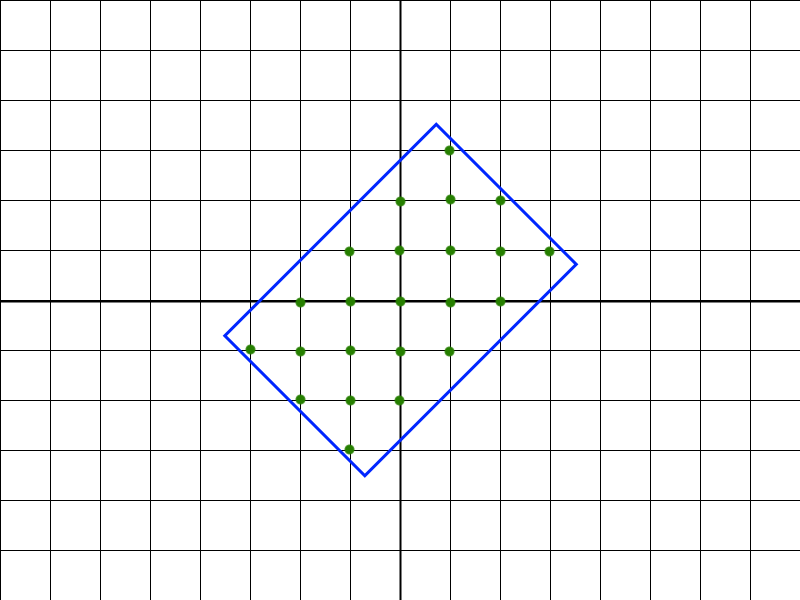

# Overview of all Functions

## Is Power?

Determine if the given number is a power of some non-negative integer.

#### Example

* For `n = 125`, the output should be
  `isPower(n) = true`;
* For `n = 72`, the output should be
  `isPower(n) = false`.
#### Input/Output

* **[input] integer n**

A positive integer.

Guaranteed constraints:
1 ≤ n ≤ 400.

* **[output] boolean**

`true` if `n` can be represented in the form `ab` (`a` to the power of `b`) where `a` and `b` are some non-negative integers and `b ≥ 2`, false otherwise.

## Is Sum of Consecutive 2

Find the number of ways to express `n` as sum of some (at least two) consecutive positive integers.

#### Example

* For `n = 9`, the output should be
  `isSumOfConsecutive2(n) = 2`.

  There are two ways to represent `n = 9`: `2 + 3 + 4 = 9 and 4 + 5 = 9`.

* For `n = 8`, the output should be
  `isSumOfConsecutive2(n) = 0`.

  There are no ways to represent `n = 8`.

#### Input/Output

* **[input] integer n**

A positive integer.

Guaranteed constraints:
1 ≤ n ≤ 104.

* **[output] integer**

## Square Digits Sequence

Consider a sequence of numbers `a0`, `a1`, ..., `an`, in which an element is equal to the sum of squared digits of the previous element. The sequence ends once an element that has already been in the sequence appears again.

Given the first element `a0`, find the length of the sequence.

#### Example

* For `a0 = 16`, the output should be
  `squareDigitsSequence(a0) = 9`.

  Here's how elements of the sequence are constructed:

  * `a0 = 16`
  * `a1 = 12 + 62 = 37`
  * `a2 = 32 + 72 = 58`
  * `a3 = 52 + 82 = 89`
  * `a4 = 82 + 92 = 145`
  * `a5 = 12 + 42 + 52 = 42`
  * `a6 = 42 + 22 = 20`
  * `a7 = 22 + 02 = 4`
  * `a8 = 42 = 16`, which has already occurred before (`a0`)
  Thus, there are `9` elements in the sequence.

* For `a0 = 103`, the output should be
  `squareDigitsSequence(a0) = 4`.

  The sequence goes as follows: `103 -> 10 -> 1 -> 1`, `4` elements altogether.

#### Input/Output

* **[input] integer a0**

  First element of a sequence, positive integer.

  Guaranteed constraints:
  1 ≤ a0 ≤ 105.

* **[output] integer**

## Pages Numbering With Ink

You work in a company that prints and publishes books. You are responsible for designing the page numbering mechanism in the printer. You know how many digits a printer can print with the leftover ink. Now you want to write a function to determine what the last page of the book is that you can number given the `current` page and `numberOfDigits` left. A page is considered numbered if it has the full number printed on it (e.g. if we are working with page `102` but have ink only for two digits then this page will not be considered numbered).

It's guaranteed that you can number the `current` page, and that you can't number the last one in the book.

#### Example

* For `current = 1` and `numberOfDigits = 5`, the output should be
  `pagesNumberingWithInk(current, numberOfDigits) = 5`.

  The following numbers will be printed: `1`, `2`, `3`, `4`, `5`.

* For `current = 21` and `numberOfDigits = 5`, the output should be
  `pagesNumberingWithInk(current, numberOfDigits) = 22`.

  The following numbers will be printed: `21`, `22`.

  For `current = 8` and `numberOfDigits = 4`, the output should be
  `pagesNumberingWithInk(current, numberOfDigits) = 10`.

  The following numbers will be printed: `8`, `9`, `10`.

#### Input/Output

* **[input] integer current**

  A positive integer, the number on the current page which is not yet printed.

  Guaranteed constraints:
  1 ≤ current ≤ 1000.

* **[input] integer numberOfDigits**

  A positive integer, the number of digits which your printer can print.

  Guaranteed constraints:
  1 ≤ numberOfDigits ≤ 1000.

* **[output] integer**

The last printed page number.

## Comfortable Numbers

Let's say that number `a` feels *comfortable* with number `b` if `a ≠ b` and `b` lies in the segment `[a - s(a), a + s(a)]`, where `s(x)` is the sum of `x`'s digits.

How many pairs `(a, b)` are there, such that `a < b`, both `a` and `b` lie on the segment `[l, r]`, and each number feels *comfortable* with the other (so `a` feels *comfortable* with `b` and `b` feels *comfortable* with `a`)?

#### Example

For `l = 10` and `r = 12`, the output should be
`comfortableNumbers(l, r) = 2`.

Here are all values of `s(x)` to consider:

* `s(10) = 1`, so `10` is *comfortable* with `9` and `11`;
* `s(11) = 2`, so `11` is *comfortable* with `9`, `10`, `12` and `13`;
* `s(12) = 3`, so `12` is *comfortable* with `9`, `10`, `11`, `13`, `14` and `15`.

Thus, there are `2` pairs of numbers *comfortable* with each other within the segment `[10; 12]`: `(10, 11)` and `(11, 12)`.

#### Input/Output

* **[input] integer l**

Guaranteed constraints:
1 ≤ l ≤ r ≤ 1000.

* **[input] integer r**

Guaranteed constraints:
1 ≤ l ≤ r ≤ 1000.

* **[output] integer**

The number of pairs satisfying all the above conditions.

## Weak Numbers

We define the *weakness* of number `x` as the number of positive integers smaller than `x` that have more divisors than `x`.

It follows that the *weaker* the number, the greater overall *weakness* it has. For the given integer `n`, you need to answer two questions:

* what is the *weakness* of the *weakest* numbers in the range `[1, n]`?
* how many numbers in the range `[1, n]` have this *weakness*?

Return the answer as an array of two elements, where the first element is the answer to the first question, and the second element is the answer to the second question.

#### Example

For `n = 9`, the output should be
`weakNumbers(n) = [2, 2]`.

Here are the number of divisors and the specific *weakness* of each number in range `[1, 9]`:

* `1`: d(1) = 1, weakness(1) = 0;
* `2`: d(2) = 2, weakness(2) = 0;
* `3`: d(3) = 2, weakness(3) = 0;
* `4`: d(4) = 3, weakness(4) = 0;
* `5`: d(5) = 2, weakness(5) = 1;
* `6`: d(6) = 4, weakness(6) = 0;
* `7`: d(7) = 2, weakness(7) = 2;
* `8`: d(8) = 4, weakness(8) = 0;
* `9`: d(9) = 3, weakness(9) = 2.

As you can see, the maximal *weakness* is `2`, and there are `2` numbers with that *weakness* level.

#### Input/Output

* **[input] integer n**

Guaranteed constraints:
1 ≤ n ≤ 1000.

* **[output] array.integer**

Array of two elements: the *weakness* of the *weakest* number, and the number of integers in range `[1, n]` with this weakness.

## Rectangle Rotation

A rectangle with sides equal to even integers `a` and `b` is drawn on the Cartesian plane. Its center (the intersection point of its diagonals) coincides with the point `(0, 0)`, but the sides of the rectangle are not parallel to the axes; instead, they are forming `45` degree angles with the axes.

How many points with integer coordinates are located inside the given rectangle (including on its sides)?

#### Example

For `a = 6` and `b = 4`, the output should be
`rectangleRotation(a, b) = 23`.

The following picture illustrates the example, and the 23 points are marked green.



#### Input/Output

* **[input] integer a**

A positive even integer.

Guaranteed constraints:
2 ≤ a ≤ 50.

* **[input] integer b**

A positive even integer.

Guaranteed constraints:
2 ≤ b ≤ 50.

* **[output] integer**

The number of inner points with integer coordinates.

## Crossword Formation

You're a crossword fanatic, and have finally decided to try and create your own. However, you also love symmetry and good design, so you come up with a set of rules they should follow:

* the crossword must contain exactly four words;
* these four words should form four pairwise intersections;
* all words must be written either left-to-right or top-to-bottom;
* the area of the rectangle formed by empty cells inside the intersections isn't equal to zero.

Given `4` words, find the number of ways to make a crossword following the above-described rules. Note that two crosswords which differ by rotation are considered different.

#### Example

For `words = ["crossword", "square", "formation", "something"]`, the output should be
`crosswordFormation(words) = 6`.

The six crosswords can be formed as shown below:

```
  f                         f                             f
  o                     c r o s s w o r d     c r o s s w o r d
c r o s s w o r d           r   o                   q     r
  m   q                     m   m                   u     m
  a   u            ;  s q u a r e          ;        a     a
  t   a                     t   t                   r     t
  i   r                     i   h             s o m e t h i n g
s o m e t h i n g           o   i                         o
  n                         n   n                         n
                                g                               
                                                              
    c         s               s                                      
f o r m a t i o n       c     q               c         s          
    o         m         r     u               r         o      
    s q u a r e       f o r m a t i o n       o         m            
    s         t    ;    s     r            ;  s q u a r e                  
    w         h         s o m e t h i n g     s         t         
    o         i         w                     w         h     
    r         n         o                   f o r m a t i o n            
    d         g         r                     r         n         
                        d                     d         g      
```
#### Input/Output

* **[input] array.string words**

An array of distinct strings, the words you need to use in your crossword.

Guaranteed constraints:
`words.length = 4`,
3 ≤ words[i].length < 15.

* **[output] integer**

The number of ways to make a correct crossword of the desired formation.